<div align="center">


<a href="https://git.io/typing-svg">
  
</a>

<p>
  <a href="mailto:skr2rathishan@gmail.com"></a>
  <a href="https://www.linkedin.com/in/mahendran-rathishan-39812b316"></a>
  <a href="https://github.com/skr2rathishan-oss"></a>
  <a href="https://leetcode.com/u/CnHPITH07z/"></a>
  
</p>

<a href="#about-me">About</a> &nbsp;•&nbsp;
<a href="#technology-constellation">Technologies</a> &nbsp;•&nbsp;
<a href="#github-analytics">Analytics</a> &nbsp;•&nbsp;
<a href="#leetcode-progress">LeetCode</a> &nbsp;•&nbsp;
<a href="#lets-connect">Connect</a>

</div>

---

## About Me

```yaml
name: M. Rathishan
education: Computer Engineering Undergraduate — University of Ruhuna, Sri Lanka
interests: [Artificial Intelligence, Machine Learning, Full-Stack Development]
currently_exploring: [Generative AI, LLMs, Cloud Technologies, Docker]
problem_solving: Data Structures & Algorithms
mindset: Build. Learn. Improve. Repeat.
```

I enjoy turning ideas into **practical, scalable, and easy-to-use products**. My work sits at the intersection of software engineering and intelligent systems—from full-stack applications and REST APIs to machine learning, automation, robotics, and IoT.

> Open to collaborating on meaningful projects, learning with ambitious teams, and building technology that makes a difference.

## Current Focus

<div align="center">

| 🤖 Intelligent Systems | 🌐 Software Engineering | ⚙️ Engineering Practice |
| :---: | :---: | :---: |
| AI & Machine Learning | Full-Stack Applications | REST APIs & Automation |
| Generative AI & LLMs | Backend Development | Docker & Cloud Tools |
| Robotics & IoT | TypeScript & JavaScript | Data Structures & Algorithms |

</div>

---

## Technology Constellation

<p align="center"><sub>Click a category to expand it, then hover over or select any icon to explore the technology.</sub></p>

<details open>
<summary><b>💻 Programming Languages</b></summary>
<br>
<p align="center">
  <a href="https://www.python.org/" title="Python"></a>&nbsp;
  <a href="https://isocpp.org/" title="C++"></a>&nbsp;
  <a href="https://developer.mozilla.org/docs/Web/JavaScript" title="JavaScript"></a>&nbsp;
  <a href="https://www.typescriptlang.org/" title="TypeScript"></a>
</p>
</details>

<details open>
<summary><b>🌐 Web & API Development</b></summary>
<br>
<p align="center">
  <a href="https://react.dev/" title="React"></a>&nbsp;
  <a href="https://nodejs.org/" title="Node.js"></a>&nbsp;
  <a href="https://expressjs.com/" title="Express"></a>&nbsp;
  <a href="https://www.postman.com/" title="Postman & REST APIs"></a>
</p>
</details>

<details open>
<summary><b>🤖 AI, Machine Learning & Data</b></summary>
<br>
<p align="center">
  <a href="https://www.tensorflow.org/" title="TensorFlow"></a>&nbsp;
  <a href="https://pytorch.org/" title="PyTorch"></a>&nbsp;
  <a href="https://scikit-learn.org/" title="Scikit-learn"></a>&nbsp;
  <a href="https://www.langchain.com/" title="LangChain"></a>&nbsp;
  <a href="https://numpy.org/" title="NumPy"></a>&nbsp;
  <a href="https://pandas.pydata.org/" title="Pandas"></a>&nbsp;
  <a href="https://scipy.org/" title="SciPy"></a>
</p>
</details>

<details open>
<summary><b>🗄️ Databases, Cloud & Developer Tools</b></summary>
<br>
<p align="center">
  <a href="https://www.mongodb.com/" title="MongoDB"></a>&nbsp;
  <a href="https://www.mysql.com/" title="MySQL"></a>&nbsp;
  <a href="https://git-scm.com/" title="Git"></a>&nbsp;
  <a href="https://github.com/" title="GitHub"></a>&nbsp;
  <a href="https://www.docker.com/" title="Docker"></a>&nbsp;
  <a href="https://azure.microsoft.com/" title="Microsoft Azure"></a>&nbsp;
  <a href="https://firebase.google.com/" title="Firebase"></a>
</p>
</details>

---

## GitHub Analytics

<p align="center">
  <sub>Live data from the GitHub GraphQL API · refreshed automatically every day</sub>
</p>

<div align="center">

<a href="https://github.com/skr2rathishan-oss">
  
</a>

</div>

<details open>
<summary><b>📡 Contribution Signal — explore the last 365 days</b></summary>

<br>

<div align="center">

<a href="https://github.com/skr2rathishan-oss">
  
</a>

</div>

</details>

<details>
<summary><b>🧬 Language Footprint — open the repository language map</b></summary>

<br>

<div align="center">

<a href="https://github.com/skr2rathishan-oss?tab=repositories">
  
</a>

</div>

</details>

<div align="center">

<br>

<a href="https://github.com/skr2rathishan-oss?tab=repositories">
  
</a>
&nbsp;
<a href="https://github.com/skr2rathishan-oss">
  
</a>
&nbsp;
<a href="https://github.com/skr2rathishan-oss?tab=followers">
  
</a>

<br><br>

<sub>Click any dashboard to open the live profile · generated from real account data, never hard-coded</sub>

</div>

---

## LeetCode Progress

<div align="center">

<a href="https://leetcode.com/u/CnHPITH07z/">
  
</a>

<br><br>

<a href="https://leetcode.com/u/CnHPITH07z/">
  
</a>

</div>

---

## Let's Connect

<div align="center">

I’m always happy to discuss **AI, software engineering, open-source ideas, or a project worth building**.

<br>

<a href="https://www.linkedin.com/in/mahendran-rathishan-39812b316">
  
</a>
&nbsp;
<a href="mailto:skr2rathishan@gmail.com">
  
</a>

<br><br>

### Build. Learn. Improve. Repeat.

<sub>Thanks for visiting if something here inspires you, feel free to connect.</sub>


</div>
